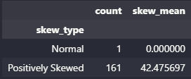
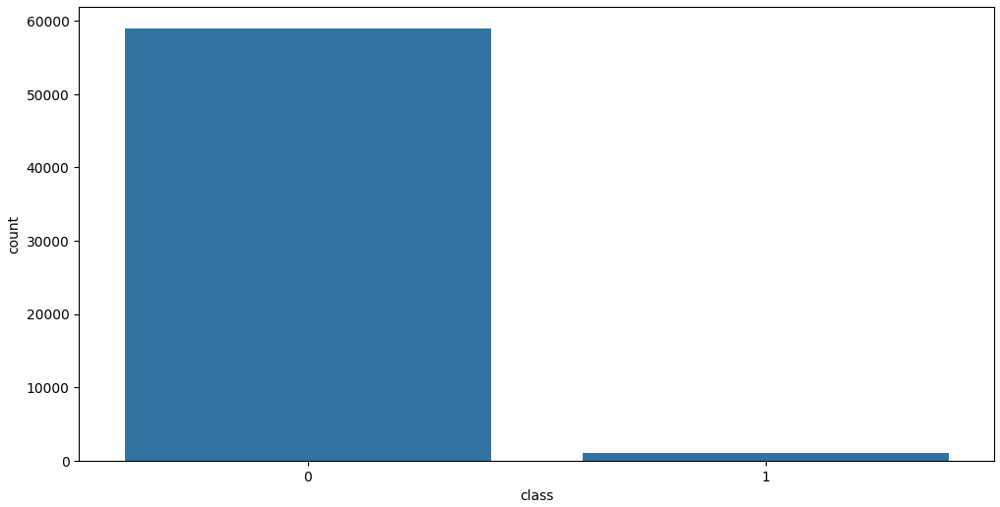
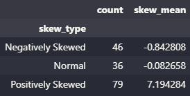
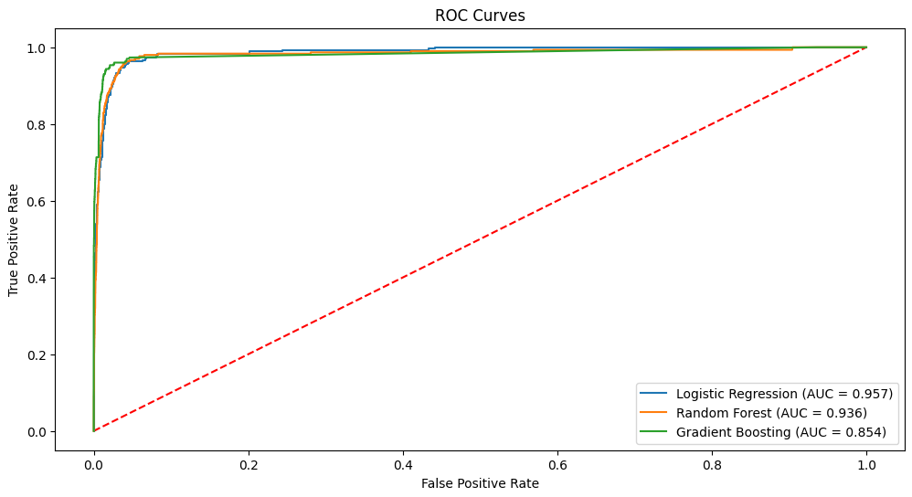
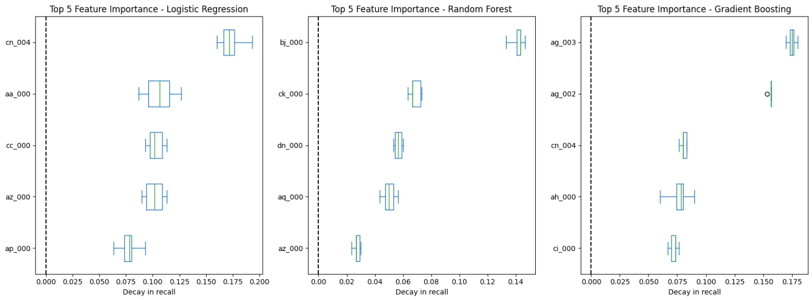
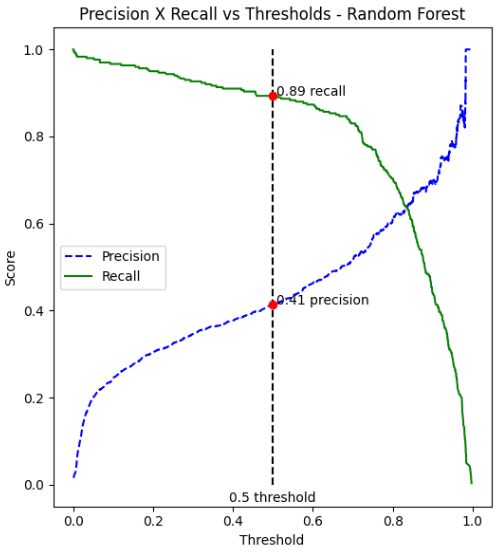
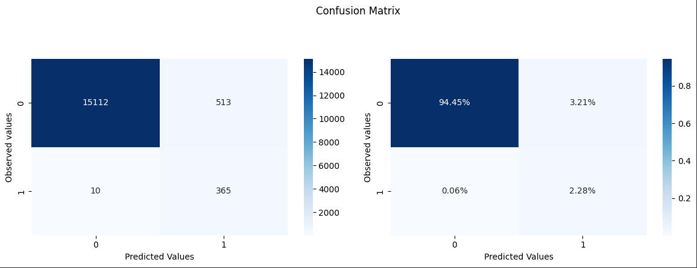

# [Trucks Air System Maintenance Prediction](https://airsystempred.azurewebsites.net/)


## Dataset
The two datasets for this project were given by Bix Tecnologia, and are about data of the air system of trucks.
Both have 171 columns, with the previous years dataset having 60.000 rows and the present year one, 16.000 rows.
For security reasons, the only non-encrypted column name is the target `class`

## Objectives
The two main objectives of this project are:

**To develop a failure prediction model from the offered dataset and put it in production to reduce costs**

**To identify the main factors that point to a possible failure in the system**

To achieve these objectives, the following technical sub-objectives were set:

1. To clean the dataset, handling all NaN values
2. To perform exploratory data analysis of the dataset
3. To select and fix data distribution based on the available features
4. To develop a supervised model to predict failures
5. To put the model in production with a pkl file

## Main Insights
From the data cleaning and exploratory data analysis, these were the main points that stood out:
- There were 8 columns with more than 50% of their values as NaN. Since this is too high, all of them were dropped
- All columns but one were positively skewed, with the one being normally distributed


  
- `class` had a massive data imbalance



## Feature Selection and Data Distribution
The first step of this phase was to fix the huge data distribution problem. For this, log and cubic transformations were applied to the columns, and each skew value was compared to see what was the best transformation for each column. After that, the dataset became more normalized, with 111 columns having their number of outliers reduced.



Since the dataset still had 161 features, a correlation matrix was done to see how many columns had a correlation of at least 0.5 with the target `class`, and PCA and ANOVA testing were used to first, see how many columns were needed to maintain 99% of the data variance and to choose them. The correlation matrix showed that 17 columns had at least a 0.5 correlation with the target, those being:

```json
["aa_000", "ah_000", "an_000", "ao_000", "ap_000", "aq_000", "bb_000", "bg_000", "bj_000", "bt_000", "bu_000", "bv_000", "bx_000", "by_000", "cc_000", "ci_000", "cq_000"]
```

When applying PCA, the graph showed that the inflection point where the number of components retained 99% of the data variance was 67.


With this number, ANOVA testing was used to choose the most important 67 features of the dataset, using f_classif score. All 17 features with at least 0.5 correlation with the target were selected by this method.

## Models
### Model Performance
For the modeling phase, three models were used: Logistic Regression, Random Forest and Gradient Boosting. Each model was trained and tested using the cleaned original dataset and a new version that contains only the features selected by PCA and ANOVA. During each training and testing, two methods were used to solve the imbalance issue of the target. The first one was the parameter `class_weight` on the models that have it. The second method was the utilization of `SMOTE`, an oversampling method that uses synthetic data to balance the target. `SMOTE` will only be applied to the training sets, with the test sets having the original imbalance of the data. After the models were trained and tested, they were evaluated in terms of the metrics `Recall`, `Precision`, `f1` and `ROC-AUC`. Recall is the main metric here, since the primary goal is to save money. The metric will measure the proportion of true positives out of the actual positives, with a high recall consisting of a low number of false negatives. Precision will measure the proportion of positive predictions that are actually correct, with fewer false positives indicating a higher precision. F1 will be the harmonic average between them, and ROC-AUC will evaluate the model's ability to discriminate the data between the two classes. Also, the top 5 most important features of each model were plotted in relation to the decrease in `recall`. To train the models, a repo in DagsHub was used, along with MLflow to keep track of all the information about the models.



The logistic regression had the highest `ROC-AUC` score, with the random forest being close behind. Despite having a good score, the gradient boosting model still felt mediocre compared to the other models scores.

### Model Explainability



The logistic regression model had a well balanced top 5 most important features, and the random forest had `bj_000` as the most important feature in every test. This indicates that, for the random forest model, the values of `bj_000` are important to be accurate because they affect the most the `recall` when permutated

## Model Selection

Despite having a very good `ROC-AUC` score, the random forest model showed that it could have a way better performance if the threshold of the model was changed.



By changing the threshold to 0.2, there would be a big `recall` gain and a samll loss to `precision`. 



When adjusting the threshold, the model had only 10 false negatives. Since the company wants the model with the least cost of maintenance, this model was selected for deployment. It has a **19.7%** lower cost than the year 2016, which was the year with the lowest cost of maintenance, and a big **48%** lower cost when compared to 2020, the year with the highest maintenance cost. The model parameters are:
```json
{
    class_weight: "balanced",
    criterion: "gini",
    max_depth: 10,
    max_features: "log2",
    n_estimators: 50,
    random_state: 42
}
```

## App Usage

The easiest way to use the app is by accessing this link: <https://airsystempred.azurewebsites.net/>

However, since the deployment was made with the free plan from Azure, which only gives 60min of usage per day, the other way is through a Docker image or running with uvicorn. Here is a step by step guide on how to create and run this image and how to run the app locally through uvicorn:

### Docker Image
### Step 1: Build Docker Image

The easiest way to build and run a docker image is with Docker Desktop. It can be downloaded [here](https://www.docker.com/products/docker-desktop/).
Clone the repository and go to the folder with the Dockerfile. Then, run the following command to build the image:

```shell
docker build -t air_system_pred:latest .
```

To check if the image was created successfully, run `docker images` in your CLI and you should see `air_system_pred` listed.

### Step 2: Run Docker Image

In the same CLI, run the following command to run the image:

```shell
docker run -p 80:80 air_system_pred:latest
```

You should see something like this:

```shell
INFO:     Started server process [1]
INFO:     Waiting for application startup.
INFO:     Application startup complete.
INFO:     Uvicorn running on http://0.0.0.0:80 (Press CTRL+C to quit)
```

Open a web browser page and type `localhost` in the search bar. The app should load and be ready for use. Use the datasets in the folder `Data` (inside the `Notebooks` folder) to test the `Predict with Dataset` function.

## Running locally trough uvicorn (this assumes that you have python installed)
### Step 1: Install libraries

Clone or download this repository, then go to the main folder of the project (where requirements.txt is). Open a command prompt in this folder and run this command:

```shell
pip install -r requirements.txt
```

### Step 2: Run the app

On the same command prompt, run the following command to run the app:

```shell
uvicorn app.main:app --reload
```

You should see something like this:

```shell
INFO:     Uvicorn running on http://127.0.0.1:8000 (Press CTRL+C to quit)
INFO:     Started reloader process [18496] using WatchFiles
INFO:     Started server process [1344]
INFO:     Waiting for application startup.
INFO:     Application startup complete.
```

Copy the adress that the app is running, in this case `http://127.0.0.1:8000` and open it on a web browser, or simply type in the browser `localhost:8000`. The app should load and be ready for use. Use the datasets in the folder `Data` (inside the `Notebooks` folder) to test the `Predict with Dataset` function.
