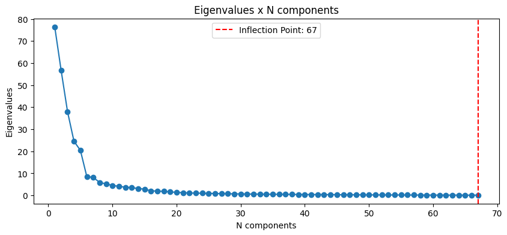

# Trucks Air System Maintenance Prediction


## Dataset
The two datasets for this project were given by Bix Tecnologia, and are about data of the air system of trucks.
Both have 171 columns, with the previous years dataset having 60.000 rows and the present year one, 16.000 rows.
For security reasons, the only non-encrypted column name is the target `class`

## Objectives
The two main objectives of this project are:

**To develop a failure prediction model from the offered dataset and put it in production to reduce costs**

**To identify the main factors that point to a possible failure in the system**

To achieve these objectives, the following technical sub-objectives were set:

1. To clean the dataset, handling all NaN values
2. To perform exploratory data analysis of the dataset
3. To select and fix data distribution based on the available features
4. To develop a supervised model to predict failures
5. To put the model in production with a pkl file

## Main Insights
From the data cleaning and exploratory data analysis, these were the main points that stood out:
- There were 8 columns with more than 50% of their values as NaN. Since this is too high, all of them were dropped
- All columns but one were positively skewed, with the one being normally distributed


  
- `class` had a massive data imbalance


## Feature Selection and Data Distribution
The first step of this phase was to fix the huge data distribution problem. For this, log and cubic transformations were applied to the columns, and each skew value was compared to see what was the best transformation for each column. After that, the dataset became more normalized, with 111 columns having their number of outliers reduced.


Since the dataset still had 161 features, a correlation matrix was done to see how many columns had a correlation of at least 0.5 with the target `class`, and PCA and ANOVA testing were used to first, see how many columns were needed to maintain 99% of the data variance and to choose them. The correlation matrix showed that 17 columns had at least a 0.5 correlation with the target, those being:

```json
["aa_000", "ah_000", "an_000", "ao_000", "ap_000", "aq_000", "bb_000", "bg_000", "bj_000", "bt_000", "bu_000", "bv_000", "bx_000", "by_000", "cc_000", "ci_000", "cq_000"]
```

When applying PCA, the graph showed that the inflection point where the number of components retained 99% of the data variance was 67.



With this number, ANOVA testing was used to choose the most important 67 features of the dataset, using f_classif score. All 17 features with at least 0.5 correlation with the target were selected by this method.

## Models
### Model Performance
For the modeling phase, three models were used: Logistic Regression, Random Forest and Gradient Boosting. Each model was trained and tested using the cleaned original dataset and a new version that contains only the features selected by PCA and ANOVA. During each training and testing, two methods were used to solve the imbalance issue of the target. The first one was the parameter `class_weight` on the models that have it. The second method was the utilization of `SMOTE`, an oversampling method that uses synthetic data to balance the target. `SMOTE` will only be applied to the training sets, with the test sets having the original imbalance of the data. After the models were trained and tested, they were evaluated in terms of the metrics `Recall`, `Precision`, `f1` and `ROC-AUC`. Recall is the main metric here, since the primary goal is to save money. The metric will measure the proportion of true positives out of the actual positives, with a high recall consisting of a low number of false negatives. Precision will measure the proportion of positive predictions that are actually correct, with fewer false positives indicating a higher precision. F1 will be the harmonic average between them, and ROC-AUC will evaluate the model's ability to discriminate the data between the two classes. Also, the top 5 most important features of each model were plotted in relation to the decrease in `recall`. To train the models, a repo in DagsHub was used, along with MLflow to keep track of all the information about the models.
